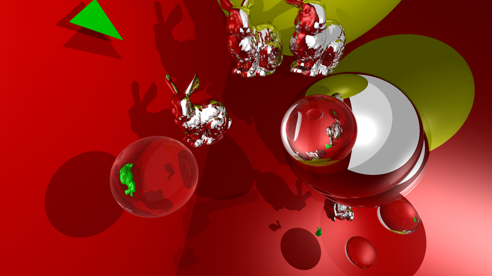
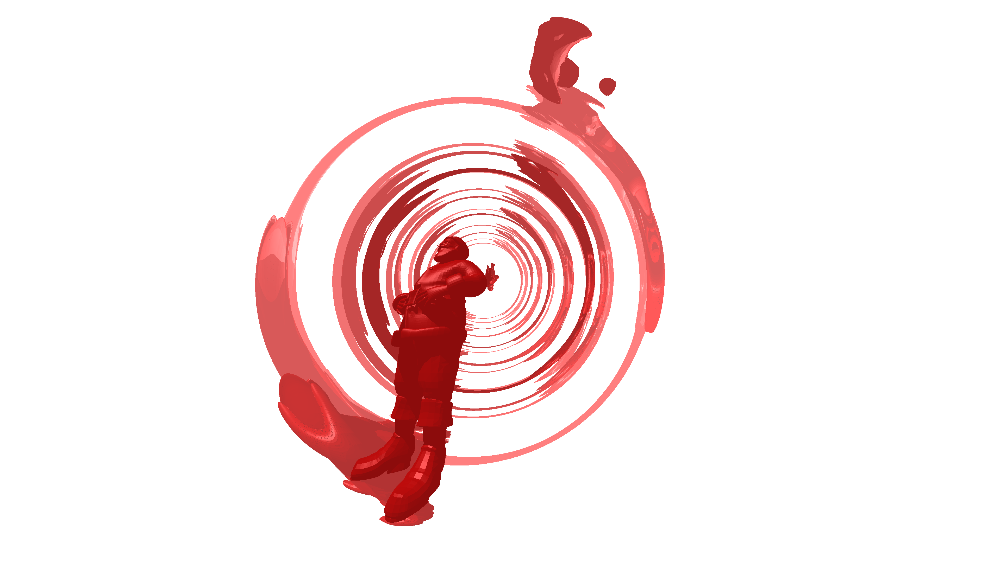
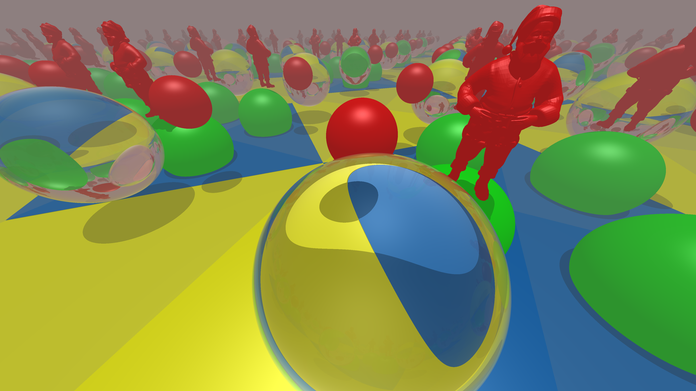

# Whitted Raytracer in Rust
### Try it on [Github Pages](https://therdel.github.io/rust_raytracer)!
- translated previously built university project from C++ to Rust
- native app and webapp (WASM)






### TODO
[x] rename "exercise1" shit
[ ] web_app: put wasm-bindgen into build script
[ ] web_app: copy resources within build script - https://github.com/sotrh/learn-wgpu/blob/0.13/code/intermediate/tutorial12-camera/build.rs
[ ] Cheat obj --> loader
[ ] Load cheat objects from main?
[ ] fetch objs from workers
[ ] do cheat obj BVHs in seperate worker, async, while displaying cornell in parallel
    [ ] BVH serde to pass between workers
        --> bitcode crate: https://docs.rs/bitcode/latest/bitcode/
    [ ] pre-build BVHs, deploy in GH-pages
        --> bitcode crate: https://docs.rs/bitcode/latest/bitcode/
[x] Make background an ```enum { Color, DirectionColor, HdrMap }```

### TODO GPGPU
[x] read buffer into canvas
[x] Materials Arc --> Material IDs
[ ] Directly couple canvas, stop GPU<>CPU copying
  - Option 1: Maybe Compute writes to canvas directly, passing it as a GPUTexture or "StorageTexture"?
  - Option 2: WebGPU Explainer: Canvas Output [source](https://gpuweb.github.io/gpuweb/explainer/#canvas-output)
    using [GPUCanvasContext](https://developer.mozilla.org/en-US/docs/Web/API/GPUCanvasContext)
  - Option 3: Compute-Shader writes to buffer, Fragment-Shader renders to quad
    [example](https://github.com/OmarShehata/webgpu-compute-rasterizer/tree/ca733f2c9dc91143364ca4e1729b2941512102e6)
[ ] Continually draw on frame (optional)
    [example](https://github.com/OmarShehata/webgpu-compute-rasterizer/blob/ca733f2c9dc91143364ca4e1729b2941512102e6/src/main.js#L31-L42)
    [MDN requestAnimationFrame](https://developer.mozilla.org/en-US/docs/Web/API/window/requestAnimationFrame)
[ ] Use pointers in WGSL
[ ] Change canvas color Endianness("Canvas Format") based on device preference
    [source](https://developer.mozilla.org/en-US/docs/Web/API/WebGPU_API#get_and_configure_the_canvas_context)
[ ] Experiment: Put into worker, measure time (hopefully fix issues with wasm-bindgen race)

### Learnt
- The WGSL storage read buffers that aren't referenced in the rest of the shader are optimized away
  to the point where there's an incompatibility between the bindgroup layouts.
- The "Canvas Format" (Color endianness) may not be RGBA but also GBRA:
  [source](https://developer.mozilla.org/en-US/docs/Web/API/WebGPU_API#get_and_configure_the_canvas_context)
- Trying to access a non-existing member yields a very bad error in Chrome 115.0.5790.171 (64-bit):
  "Tint WGSL reader failure: error: struct member x not found

   - While validating [ShaderModuleDescriptor]
   - While calling [Device].CreateShaderModule([ShaderModuleDescriptor])."
  ```wgsl
    struct BugTest {
        y: f32
    }

    fn bug(bug: BugTest) -> f32  {
        return bug.x;
    }
  ```
- WGSL doesn't allow recursion